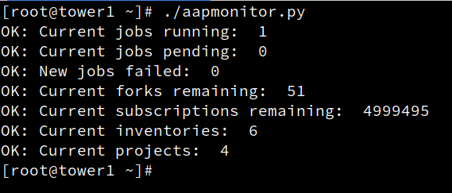

# aapmonitor
Ansible Automation Platform monitor script, developed on RHEL 8 for AAP 1.x (Tower 3.8.4+) but should work on AAP 2.x as well.
It connects to whatever automation system you like which can monitor non-zero exit codes. If any issue is detected, script exits with 1.

# Howto install it
1. Install the AAP CLI tool: https://docs.ansible.com/ansible-tower/latest/html/towercli/
2. Create a token to authenticate with: https://docs.ansible.com/ansible-tower/latest/html/administration/oauth2_token_auth.html#application-token-functions
3. Clone this repository:
```
git clone https://github.com/mglantz/aapmonitor
```
4. Install tool and put config in place:
```
cp aapmonitor/aapmonitor.py /path/to/bin/
cp aapmonitor/aapmonitor.cfg /etc
```
5. Edit the config file to set your configured token and to set monitoring alarm limits
6. Run aapmonitor.py to check if it works, then start monitoring by triggering the script from your monitoring system.



# What does it monitor?
1. If it's possible to connect to the cluster API to fetch metrics data using the AAP cli tool. This indicates a general sense of health.
2. jobs_running: Alert if we run too many jobs
3. jobs_pending: Alert if we have too many pending jobs, indicating that the cluster or a node is saturated capacity wise
4. jobs_failed_limit: Alert if we have n new jobs which has failed since last check, indicating something wrong with either jobs, cluster, network or access.
5. forks_remaining: Alert if we have fewer than n forks of remaining capacity on any node, indicating capacity issues, likely memory or CPU related.
6. subs_remaining: Alert if we run out of subscriptions. Even though Ansible Automation Platform does not do subscription management, it's an indication. Turn off by setting to 0.
7. inventory_limit: Alert if we detect fewer than n inventories. Indicates potential configuration misstakes which would cause automation to not run.
8. projects limit. Indicates potential configuration misstakes which would cause automation to not run.
